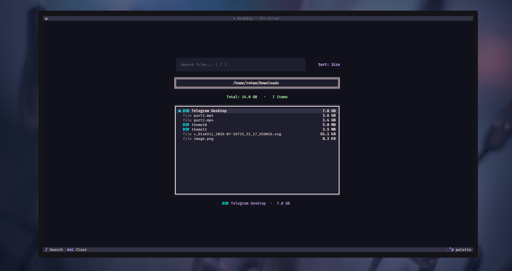

# DiskViz

A terminal-based disk space visualizer built with Python and Textual. Navigate directories, view file sizes with color-coded progress bars, and switch between 30+ themes.



## Features

- Interactive directory browsing with keyboard navigation
- Color-coded size bars (red for large, yellow for medium, green for small)
- Async scanning for non-blocking UI on large directories
- 30+ built-in and custom themes via fuzzy search
- Automatic dependency installation on first run
- Support for 20+ Linux distributions
- Single file, zero configuration

## Requirements

- Python 3.8 or higher
- A terminal emulator with 256-color support

## Installation

### Quick Start

```bash
# Clone the repository
git clone https://github.com/PzN2s/diskviz.git
cd diskviz

# Run directly
python3 diskviz.py
```

### One-Line Install

```bash
curl -O https://raw.githubusercontent.com/PzN2s/diskviz/main/diskviz.py && python3 diskviz.py
```

### System-Wide Install

```bash
# Download
curl -O https://raw.githubusercontent.com/PzN2s/diskviz/main/diskviz.py

# Make executable
chmod +x diskviz.py

# Move to PATH
sudo mv diskviz.py /usr/local/bin/diskviz

# Run from anywhere
diskviz
```

## Dependencies

DiskViz automatically installs its only dependency (`textual`) on first run using either `uv` (preferred) or `pip`. No manual setup required.

If automatic installation fails, install textual manually:

```bash
# Using uv (recommended)
uv pip install textual

# Using pip
pip3 install textual

# Using your distribution's package manager
# Arch/Manjaro
sudo pacman -S python-textual

# Fedora
sudo dnf install python3-textual

# Ubuntu/Debian
sudo apt install python3-textual
```

## Usage

### Basic Usage

```bash
# Scan current directory
python3 diskviz.py

# Scan a specific directory
python3 diskviz.py /home
python3 diskviz.py /var/log
python3 diskviz.py ..
```

### Keyboard Shortcuts

| Key | Action |
|-----|--------|
| `Up` / `Down` | Move cursor up/down |
| `Right` | Enter selected directory |
| `Left` | Go to parent directory |
| `t` | Open theme picker |
| `q` | Quit |

### Command-Line Options

```bash
# Show help
python3 diskviz.py --help

# Show version information
python3 diskviz.py -h
```

## Themes

DiskViz comes with 30+ themes. Press `t` to open the fuzzy theme picker and search by name.

### Built-in Themes (21)

| Theme | Style |
|-------|-------|
| tokyo-night | Dark, purple-blue accents |
| catppuccin-mocha | Dark, pastel colors |
| catppuccin-frappe | Dark, muted pastels |
| catppuccin-latte | Light, pastel colors |
| catppuccin-macchiato | Dark, rich pastels |
| dracula | Dark, vibrant colors |
| nord | Dark, arctic blue |
| gruvbox | Dark, retro groove |
| solarized-dark | Dark, precision colors |
| solarized-light | Light, precision colors |
| rose-pine | Dark, rose tones |
| rose-pine-moon | Dark, deeper rose |
| rose-pine-dawn | Light, dawn colors |
| monokai | Dark, classic colors |
| flexoki | Dark, ink-inspired |
| atom-one-dark | Dark, Atom editor |
| atom-one-light | Light, Atom editor |
| ansi-dark | Dark, ANSI colors |
| ansi-light | Light, ANSI colors |
| textual-dark | Dark, Textual default |
| textual-light | Light, Textual default |

### Custom Themes (10)

| Theme | Style |
|-------|-------|
| kanagawa | Dark, Japanese ink |
| everforest | Dark, green nature |
| one-dark | Dark, One editor |
| tokyo-night-storm | Dark, deeper Tokyo |
| cyberpunk | Dark, neon pink |
| oxocarbon | Dark, IBM carbon |
| modus-vivendi | Dark, high contrast |
| apprentice | Dark, muted tones |
| tokyo-xterm | Dark, pure black |
| nightfox | Dark, night colors |

## Supported Distributions

DiskViz detects your Linux distribution and provides the correct installation commands if dependencies need to be installed manually:

| Distribution | Package Manager |
|-------------|-----------------|
| Ubuntu, Debian, Linux Mint, Pop!_OS, Elementary | apt |
| Fedora, RHEL, Rocky, Alma | dnf |
| CentOS | yum |
| Arch, Manjaro, EndeavourOS | pacman |
| Alpine | apk |
| openSUSE Leap/Tumbleweed | zypper |
| Void | xbps |
| Gentoo | emerge |
| NixOS | nix-shell |
| Clear Linux | swupd |

## How It Works

1. DiskViz scans the target directory and calculates the size of each file and subdirectory
2. Results are sorted by size (largest first)
3. Each entry displays with a color-coded progress bar relative to the largest item
4. The selected item shows its full path and metadata at the bottom
5. All scanning runs asynchronously to keep the UI responsive

## License

MIT License. See [LICENSE](LICENSE) for details.

## Author

DEV:Reham
